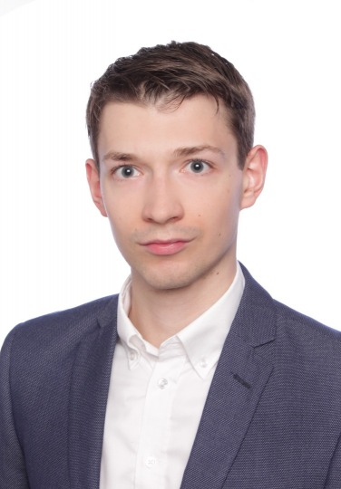

---
---

<link rel="stylesheet" href="styles.css" type="text/css">

I am passionate about new technologies like AI but also about those well-established as econometrics. In AI field I focus on NLP - I have worked in projects concernign text summarization, topic clostering, sentiment analysis and QA systems. Currently I work as an NLP Trainee in Samsung R&D Poland.

I graduated from [Warsaw School of Economics](http://www.sgh.waw.pl/en/Pages/default.aspx) with MS in quantitive methods in 2019. As my master thesis I created an multi-agent model of speculative bubble on cryptocurrency market. The full text of the thesis can be found on [ResearchGate](https://www.researchgate.net/publication/331024979_Agent-based_analysis_of_the_cryptocurrency_speculative_bubble_Master_Thesis). 

Before joining Samsung, I worked for The Chancellery of the Prime Minister of Poland and had internship in Ministry of Finance. My full CV is available [here](files/CV_Jakub_Kubajek.pdf).